# 3.4.3.1 Use Case Modelling — Shedulex

**System:** Shedulex — Intelligent Dynamic Academic Timetable Management System  
**Case study:** Kampala International University in Tanzania (KIUT)

## Actors

| Actor | Description |
|-------|-------------|
| **Admin** | University administrator; manages users, audit logs, and broadcasts |
| **Timetable Officer** | Primary operator; manages resources, generates timetables, uses AI assistant |
| **Head of Department (HOD)** | Oversees department scheduling data and published timetables |
| **Lecturer** | Views assigned schedule and receives notifications |
| **Student** | Views class timetable and receives reminders |
| **Sora AI Agent** | LangGraph assistant in adjustment-engine (secondary actor / system agent) |

## Use Case Diagram

```mermaid
flowchart TB
    subgraph Actors[" "]
        direction TB
        A1((Admin))
        A2((Timetable<br/>Officer))
        A3((HOD))
        A4((Lecturer))
        A5((Student))
        A6((Sora AI<br/>Agent))
    end

    subgraph Shedulex["Shedulex System Boundary"]
        direction TB

        subgraph Auth["Authentication & Access"]
            UC1[Register / Login]
            UC2[Manage Profile]
            UC3[Role-Based Access Control]
        end

        subgraph Resources["Resource Management"]
            UC4[Manage Universities & Departments]
            UC5[Manage Rooms & Venues]
            UC6[Manage Lecturers & Availability]
            UC7[Manage Courses & Student Groups]
            UC8[Manage Constraints & Time Slots]
            UC9[Manage Timetable Templates]
        end

        subgraph Core["Timetable Engine"]
            UC10[Generate Timetable via GA]
            UC11[View / Edit Timetable Entries]
            UC12[Detect & Predict Conflicts]
            UC13[Version Snapshots & Restore]
        end

        subgraph AI["Dynamic Adjustment"]
            UC14[Chat with Sora AI Assistant]
            UC15[Resolve Conflicts Dynamically]
            UC16[Substitute Lecturer]
            UC17[Move / Swap Sessions]
        end

        subgraph Support["Supporting Services"]
            UC18[Export PDF / Excel / CSV]
            UC19[Send SMS / Email Notifications]
            UC20[Manage Academic Calendar]
            UC21[View Analytics Dashboard]
            UC22[View Audit Logs]
        end
    end

  %% Admin
    A1 --> UC1
    A1 --> UC3
    A1 --> UC4
    A1 --> UC19
    A1 --> UC22

  %% Timetable Officer
    A2 --> UC1
    A2 --> UC2
    A2 --> UC4
    A2 --> UC5
    A2 --> UC6
    A2 --> UC7
    A2 --> UC8
    A2 --> UC9
    A2 --> UC10
    A2 --> UC11
    A2 --> UC12
    A2 --> UC13
    A2 --> UC14
    A2 --> UC18
    A2 --> UC19
    A2 --> UC20
    A2 --> UC21

  %% HOD
    A3 --> UC1
    A3 --> UC11
    A3 --> UC12
    A3 --> UC21

  %% Lecturer
    A4 --> UC1
    A4 --> UC2
    A4 --> UC11
    A4 --> UC19

  %% Student
    A5 --> UC1
    A5 --> UC11
    A5 --> UC19

  %% Sora AI (invoked by officer, acts on timetable)
    A2 -.->|triggers| UC14
    UC14 --> A6
    A6 --> UC15
    A6 --> UC16
    A6 --> UC17
```

## Use Case Summary Table

| ID | Use Case | Primary Actor(s) | Service |
|----|----------|------------------|---------|
| UC1 | Register / Login | All users | auth-service |
| UC10 | Generate Timetable via GA | Timetable Officer | timetable-engine |
| UC14 | Chat with Sora AI Assistant | Timetable Officer | adjustment-engine |
| UC18 | Export PDF / Excel / CSV | Timetable Officer | document-service |
| UC19 | Send SMS / Email Notifications | Admin, Officer | notification-service |
| UC21 | View Analytics Dashboard | Officer, HOD | analytics-service |
| UC22 | View Audit Logs | Admin | audit-service |

## Figure Caption (for report)

> **Figure 3.1 Use Case Diagram** — Shedulex actors and primary use cases across authentication, resource management, GA timetable generation, AI-assisted adjustment, and supporting microservices.
