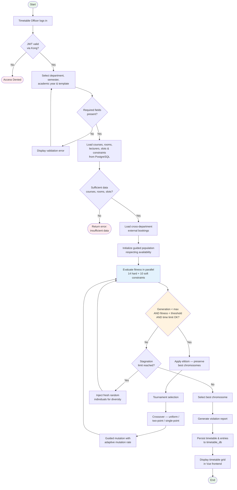
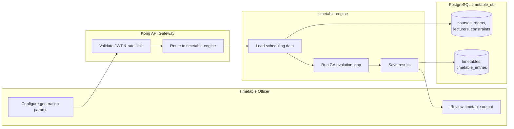

# 3.4.3.2 Activity Diagram — Timetable Generation (GA)

**Process:** Genetic Algorithm timetable generation in `timetable-engine`  
**Entry point:** `POST /api/v1/timetable/generate`

## Activity Diagram

## Swimlane View (optional)

## Key GA Steps (code reference)

| Step | Module | Description |
|------|--------|-------------|
| Load inputs | `timetable_service.py` | Converts DB entities to GA dicts |
| Initialize population | `ga/population.py` | Guided seeding with availability |
| Fitness evaluation | `ga/fitness.py` | H1–H14 hard, S1–S10 soft penalties |
| Evolution loop | `ga/engine.py` | Selection, crossover, mutation, elitism |
| Persist output | `timetable_service.py` | Writes `Timetable` + `TimetableEntry` rows |

## Figure Caption (for report)

> **Figure 3.2 Activity Diagram** — Workflow for Genetic Algorithm timetable generation from officer login through constraint loading, evolution loop, and persistence of the optimized schedule.
