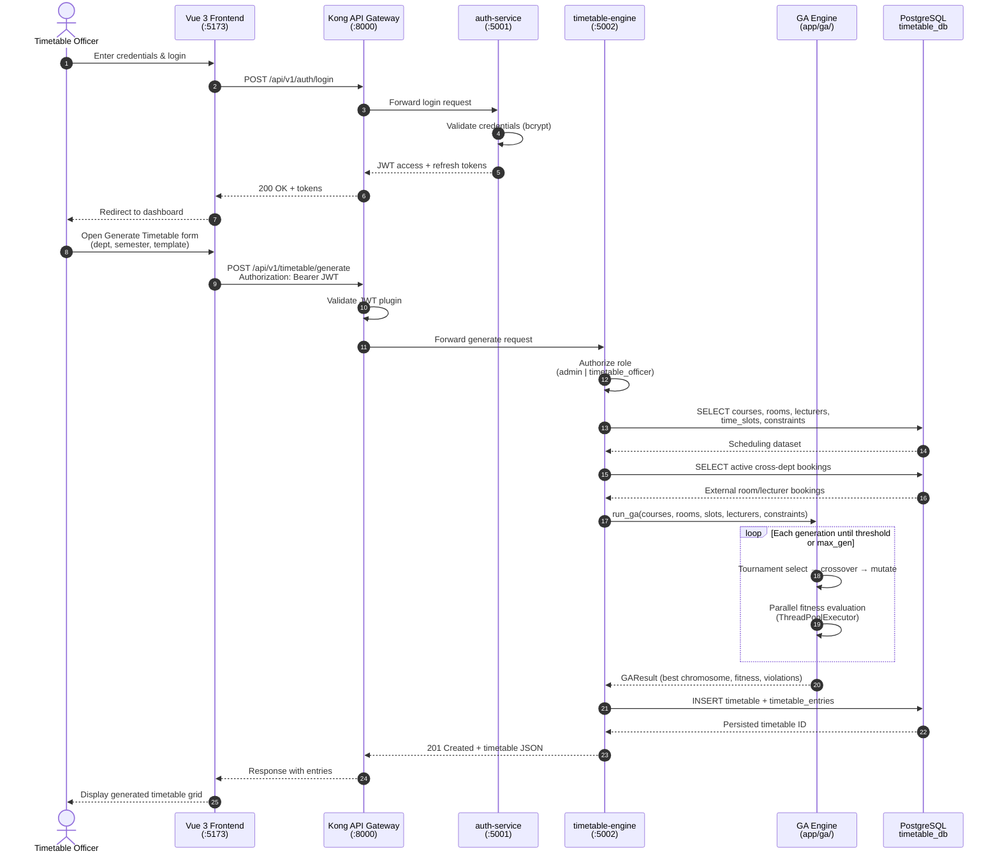
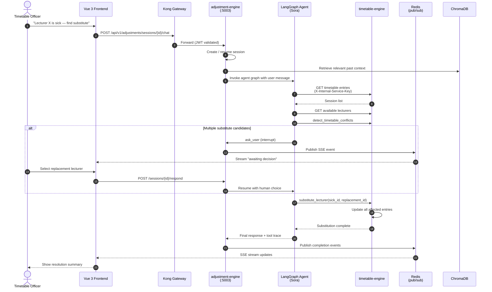

# 3.4.3.3 Sequence Diagram — Timetable Generation Request

**Scenario:** Timetable Officer generates a department timetable via the Shedulex web interface.

## Primary Sequence — GA Timetable Generation

## Secondary Sequence — AI Dynamic Adjustment (Sora)

## Figure Captions (for report)

> **Figure 3.3 Sequence Diagram** — Message flow for GA timetable generation from the Vue frontend through Kong gateway, timetable-engine, Genetic Algorithm module, and PostgreSQL persistence.

> **Figure 3.3b Sequence Diagram (optional)** — AI-assisted dynamic adjustment via the Sora LangGraph agent, adjustment-engine SSE streaming, and timetable-engine tool calls.
