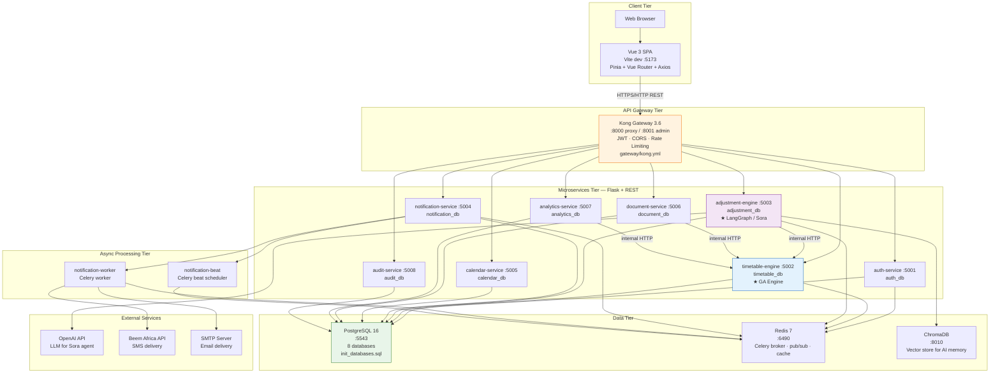
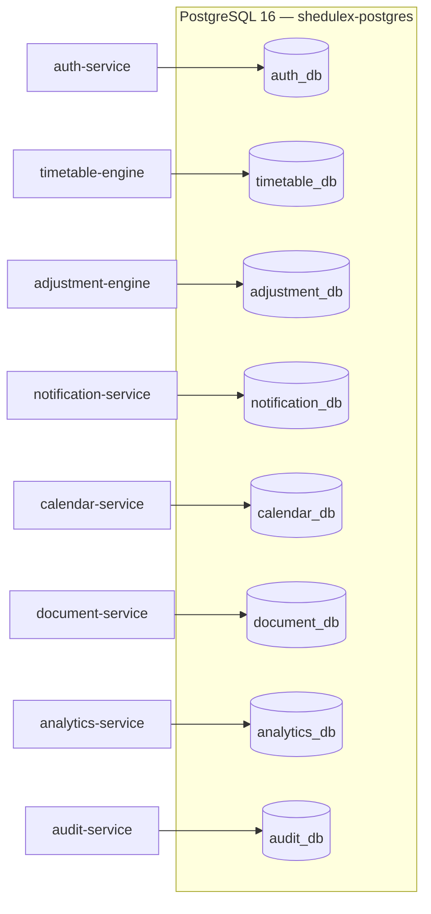

# 3.4.3.4 Deployment Diagram — Shedulex Microservices

**Orchestration:** Docker Compose (`docker-compose.yml`)  
**Network:** `shedulex-net` (bridge)

## Deployment Diagram

## Database-per-Service Mapping

## Container Reference

| Container | Image / Build | Host Port | Purpose |
|-----------|---------------|-----------|---------|
| shedulex-kong | kong:3.6-ubuntu | 8000, 8001 | API gateway |
| shedulex-auth | Backend/auth-service | 5001 | Authentication & RBAC |
| shedulex-timetable | Backend/timetable-engine | 5002 | GA generation & resources |
| shedulex-adjustment | Backend/adjustment-engine | 5003 | Sora AI assistant |
| shedulex-notification | Backend/notification-service | 5004 | SMS/email API |
| shedulex-notification-worker | Celery worker | — | Async delivery |
| shedulex-notification-beat | Celery beat | — | Scheduled reminders |
| shedulex-calendar | Backend/calendar-service | 5005 | Academic calendar |
| shedulex-document | Backend/document-service | 5006 | PDF/Excel/CSV export |
| shedulex-analytics | Backend/analytics-service | 5007 | KPI dashboards |
| shedulex-audit | Backend/audit-service | 5008 | Audit logging |
| shedulex-postgres | postgres:16-alpine | 5543 | Relational data |
| shedulex-redis | redis:7-alpine | 6490 | Cache & message broker |
| shedulex-chromadb | chromadb/chroma | 8010 | Vector embeddings |

## Kong Route Summary

| Path prefix | Upstream service | JWT required |
|-------------|------------------|--------------|
| `/api/v1/auth`, `/api/v1/users` | auth-service | Partial (login public) |
| `/api/v1/timetable`, `/api/v1/courses`, `/api/v1/rooms`, … | timetable-engine | Yes |
| `/api/v1/adjustments` | adjustment-engine | Yes |
| `/api/v1/notifications` | notification-service | Yes |
| `/api/v1/calendar` | calendar-service | Yes |
| `/api/v1/documents` | document-service | Yes |
| `/api/v1/analytics` | analytics-service | Yes |
| `/api/v1/audit` | audit-service | Yes |

## Figure Caption (for report)

> **Figure 3.4 Deployment Diagram** — Shedulex microservices deployment on Docker Compose showing the Vue frontend, Kong API gateway, eight Flask microservices, PostgreSQL database-per-service pattern, Redis, ChromaDB, and Celery workers.
